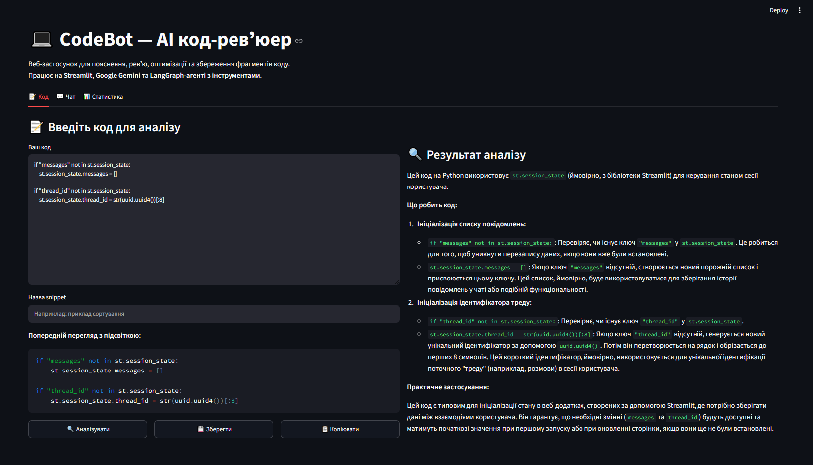
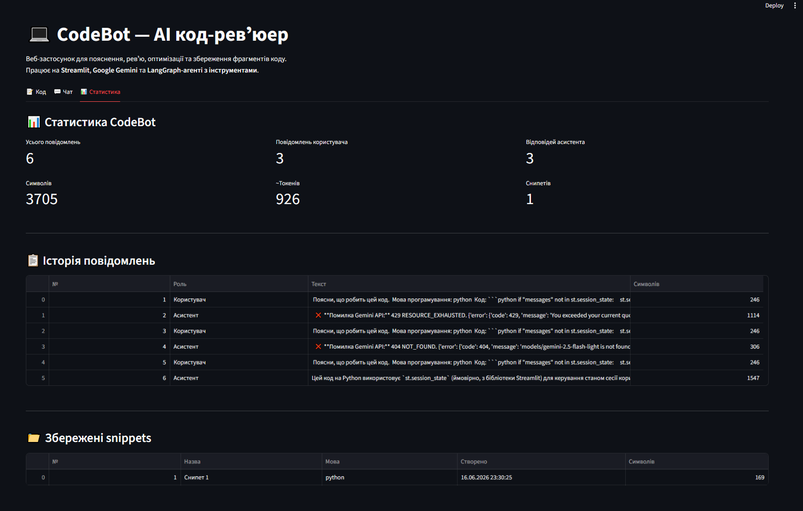
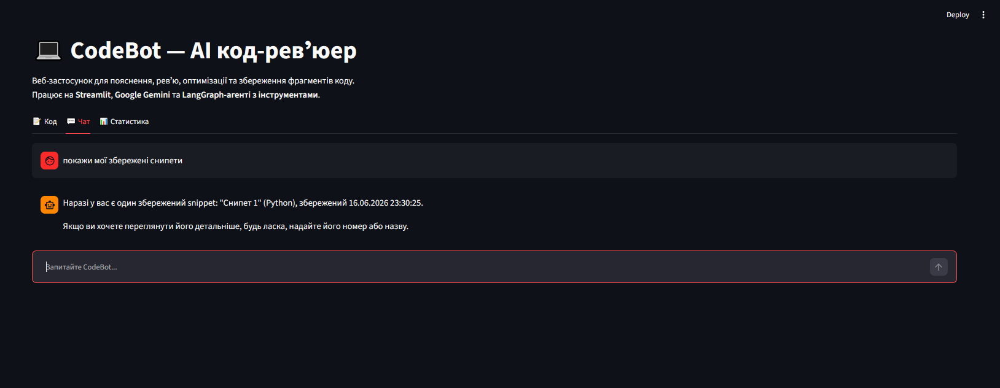
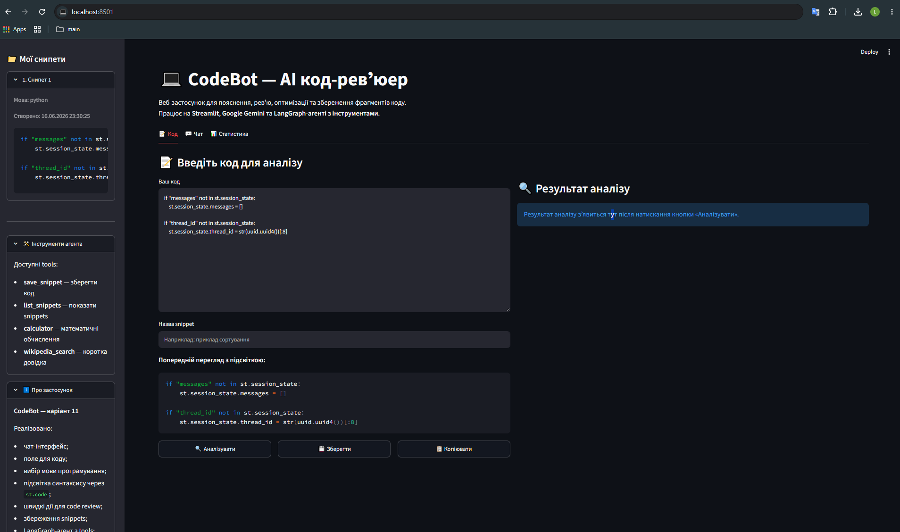

# 💻 CodeBot — AI код-ревʼюер

## Практичне завдання №3

**Дисципліна:** Штучний інтелект у розробці програмного забезпечення  
**Тема:** Створення веб-інтерфейсу для чат-бота на базі Streamlit  
**Варіант:** 11 — Код-ревʼюер «CodeBot»

---

## 1. Опис проєкту

**CodeBot** — це веб-застосунок для пояснення, ревʼю, оптимізації та збереження фрагментів коду.

Застосунок побудований на базі **Streamlit** і дозволяє користувачу працювати з кодом через зручний веб-інтерфейс без використання консолі або Jupyter Notebook.

Основні можливості:

- введення фрагментів коду;
- вибір мови програмування;
- підсвітка синтаксису через `st.code()`;
- пояснення коду за допомогою LLM;
- пошук потенційних багів;
- оптимізація коду;
- додавання коментарів;
- збереження snippets у колекцію;
- перегляд збережених snippets;
- чат із AI-асистентом;
- режим LangGraph-агента з інструментами;
- експорт історії роботи у JSON;
- перегляд статистики використання.

---

## 2. Предметна область

Обраний варіант — **Код-ревʼюер «CodeBot»**.

Тематика застосунку — допомога розробнику під час роботи з кодом. CodeBot може пояснювати фрагменти коду, знаходити помилки, пропонувати оптимізації та зберігати корисні snippets для повторного використання.

Цільова аудиторія:

- студенти, які вивчають програмування;
- розробники-початківці;
- інженери, яким потрібен швидкий аналіз коду;
- користувачі, які хочуть мати особисту колекцію корисних code snippets.

---

## 3. Використані технології

У проєкті використано:

- **Python** — основна мова розробки;
- **Streamlit** — веб-інтерфейс;
- **Google Gemini API** — мовна модель для генерації відповідей;
- **google-genai** — офіційний SDK Google для Gemini;
- **LangGraph** — побудова агента з інструментами;
- **LangChain** — інтеграція LLM та tools;
- **Wikipedia API** — пошук короткої довідкової інформації;
- **NumExpr** — безпечне виконання математичних обчислень;
- **Pandas** — формування таблиць статистики.

---

## 4. Структура проєкту

```text
chatbot-streamlit/
├── .streamlit/
│   └── secrets.toml
├── app.py
├── agent.py
├── requirements.txt
├── README.md
└── .gitignore
```

Опис файлів:

- `app.py` — основний файл Streamlit-застосунку, містить UI, чат, вкладки, sidebar, роботу з Gemini та виклик агента.
- `agent.py` — LangGraph-агент CodeBot з інструментами.
- `requirements.txt` — список залежностей.
- `.streamlit/secrets.toml` — локальний файл з API-ключем Google Gemini.
- `.gitignore` — файл для виключення секретів, кешу та службових файлів із Git.
- `README.md` — опис проєкту та інструкція з запуску.

---

## 5. Налаштування API-ключа

Для роботи з Gemini потрібно створити файл:

```text
.streamlit/secrets.toml
```

У ньому потрібно вказати API-ключ:

```toml
GOOGLE_API_KEY = "ваш_api_key"
```

Файл `secrets.toml` не повинен потрапляти в GitHub, тому він доданий у `.gitignore`.

---

## 6. Встановлення та запуск

### 6.1. Встановлення залежностей

У корені проєкту виконати:

```bash
pip install -r requirements.txt
```

### 6.2. Запуск застосунку

```bash
streamlit run app.py
```

Після запуску застосунок відкривається у браузері за адресою:

```text
http://localhost:8501
```

---

## 7. Реалізований функціонал

### 7.1. Чат-інтерфейс

У застосунку реалізовано повноцінний чат:

- повідомлення користувача та асистента відображаються через `st.chat_message()`;
- введення повідомлень реалізовано через `st.chat_input()`;
- історія діалогу зберігається у `st.session_state.messages`;
- відповіді Gemini у звичайному режимі відображаються поступово через streaming.

### 7.2. Робота з кодом

У вкладці **Код** реалізовано:

- поле введення коду через `st.text_area()`;
- вибір мови програмування через `st.selectbox()`;
- попередній перегляд коду з підсвіткою через `st.code()`;
- швидкі дії:
  - пояснити код;
  - оптимізувати код;
  - знайти баги;
  - додати коментарі.

### 7.3. Збереження snippets

CodeBot дозволяє зберігати фрагменти коду у колекцію.

Для цього реалізовано:

- кнопку збереження snippet;
- назву snippet;
- збереження мови програмування;
- відображення snippets у sidebar;
- перегляд snippets через `st.expander()`;
- підсвітку коду snippets через `st.code()`.

### 7.4. LangGraph-агент

У режимі **Агент з інструментами** використовується LangGraph-агент.

Реалізовані інструменти агента:

- `save_snippet(language, code, note)` — збереження фрагмента коду;
- `list_snippets()` — перегляд збережених snippets;
- `calculator(expression)` — виконання математичних обчислень;
- `wikipedia_search(query)` — пошук короткої довідкової інформації.

### 7.5. Статистика

У вкладці **Статистика** реалізовано:

- кількість усіх повідомлень;
- кількість повідомлень користувача;
- кількість відповідей асистента;
- кількість символів;
- приблизна кількість токенів;
- кількість збережених snippets;
- таблиця історії повідомлень;
- таблиця збережених snippets.

### 7.6. Експорт

Реалізовано експорт історії роботи у JSON через `st.download_button()`.

У JSON зберігаються:

- дата експорту;
- назва проєкту;
- варіант завдання;
- модель;
- режим роботи;
- мова програмування;
- thread_id;
- системний промпт;
- історія повідомлень;
- збережені snippets.

---

## 8. Спеціальні компоненти Streamlit

У проєкті використано такі компоненти Streamlit:

- `st.chat_message()` — відображення повідомлень чату;
- `st.chat_input()` — введення повідомлень;
- `st.text_area()` — введення коду;
- `st.code()` — підсвітка синтаксису;
- `st.selectbox()` — вибір мови програмування;
- `st.radio()` — вибір режиму та швидкої дії;
- `st.expander()` — розгортувані блоки зі snippets та налаштуваннями;
- `st.tabs()` — розділення застосунку на вкладки;
- `st.columns()` — компонування кнопок та метрик;
- `st.metric()` — статистика використання;
- `st.dataframe()` — таблиці історії та snippets;
- `st.download_button()` — експорт даних;
- `st.spinner()` — індикатор очікування;
- `st.toast()` — короткі повідомлення користувачу.

---

## 9. Приклади тестових сценаріїв

### Сценарій 1. Пояснення коду

**Вхідний код:**

```python
def add(a, b):
    return a + b

print(add(2, 3))
```

**Очікувана поведінка:**  
CodeBot пояснює, що функція `add` приймає два аргументи, повертає їх суму, а `print` виводить результат.

---

### Сценарій 2. Пошук багів

**Вхідний код:**

```python
items = [1, 2, 3]

for i in range(len(items) + 1):
    print(items[i])
```

**Очікувана поведінка:**  
CodeBot знаходить проблему виходу за межі списку через `range(len(items) + 1)`.

---

### Сценарій 3. Оптимізація коду

**Вхідний код:**

```python
result = []

for i in range(10):
    result.append(i * 2)

print(result)
```

**Очікувана поведінка:**  
CodeBot пропонує замінити цикл на list comprehension.

---

### Сценарій 4. Збереження snippet

**Дія:**  
Користувач вводить код, задає назву snippet і натискає кнопку **Зберегти**.

**Очікувана поведінка:**  
Snippet зʼявляється у sidebar у розділі **Мої снипети**.

---

### Сценарій 5. Перегляд snippets через агента

**Запит:**

```text
Покажи мої збережені коди
```

**Очікувана поведінка:**  
У режимі агента CodeBot використовує tool `list_snippets()` і показує список збережених snippets.

---

### Сценарій 6. Математичне обчислення через агента

**Запит:**

```text
Порахуй 128 * 32 / 4
```

**Очікувана поведінка:**  
У режимі агента CodeBot використовує tool `calculator()` і повертає результат обчислення.

---

## 10. Скріншоти

### Вкладка "Код" з аналізом



### Вкладка "Статистика"



### Чат з агентом



### Sidebar зі збереженими snippets



---

## 11. Обробка помилок

У застосунку реалізовано обробку помилок:

- якщо API-ключ відсутній, користувач бачить зрозуміле повідомлення;
- якщо Gemini API повертає помилку, вона відображається у UI;
- якщо користувач намагається зберегти порожній snippet, виводиться попередження;
- якщо користувач намагається аналізувати порожній код, виводиться попередження.

Під час тестування також було отримано помилку `429 RESOURCE_EXHAUSTED`, що означає вичерпання ліміту Gemini API free tier. Застосунок не впав, а коректно показав помилку в інтерфейсі.

---

## 12. Висновок

У результаті виконання практичного завдання було створено веб-застосунок **CodeBot** — AI код-ревʼюер на базі Streamlit.

Застосунок реалізує повноцінний чат-інтерфейс, інтеграцію з Google Gemini, streaming відповідей, LangGraph-агента з інструментами, спеціалізований UI для роботи з кодом, збереження snippets, статистику та експорт даних.

Проєкт відповідає вимогам варіанта 11 і може бути використаний як основа для подальшого розвитку AI-інструментів для програмістів.
